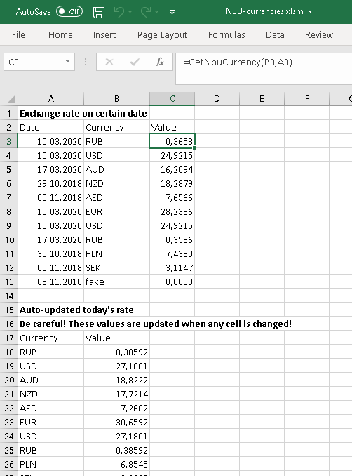

# NBU-VBA-Currencies
Load NBU currencies in Excel (from bank.gov.ua)

The macro allowes to load currency to Excel worksheet. It can be used directly in formulas such as:

`=GetNbuCurrency("RUB";"5/31/2020")`

Moreover, you can use formula with volatileArg like NOW(), that will force refreshing the values:

`=NbuTodayCurrency(C10;NOW())`

So when you open the workbook, values will be reloaded:

Be careful with this approach if you have large set of currency values!